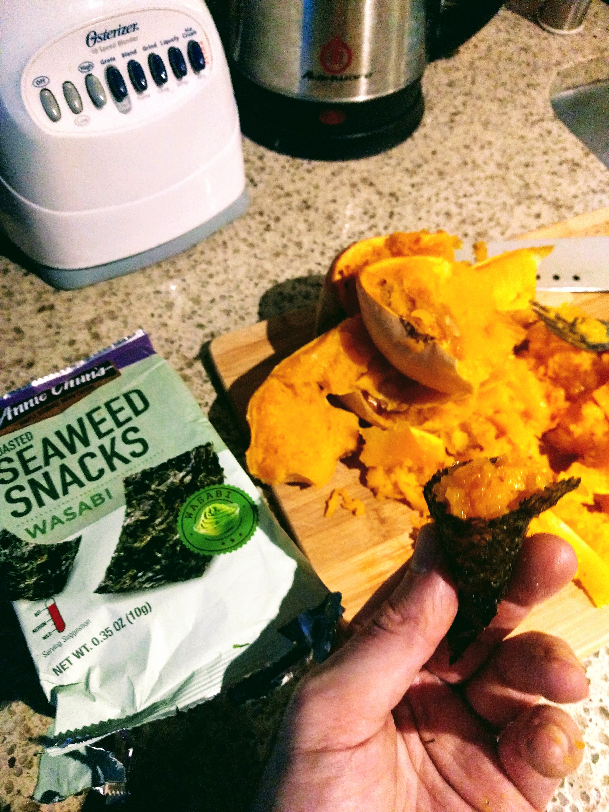
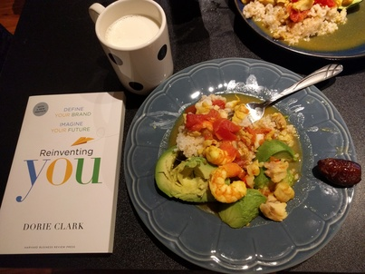
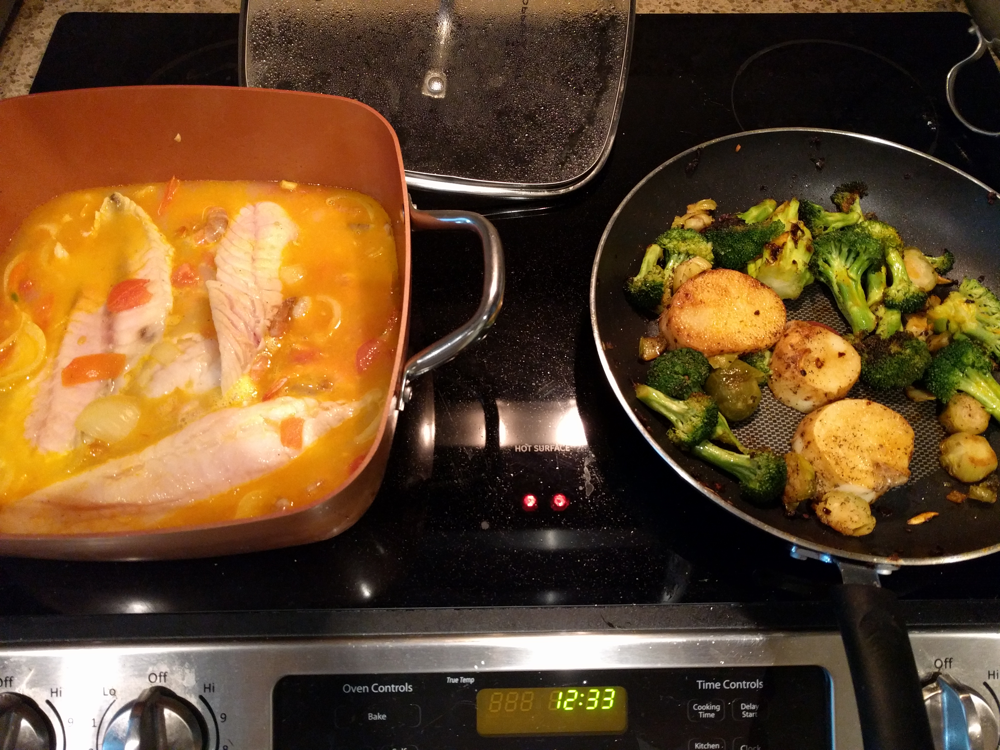
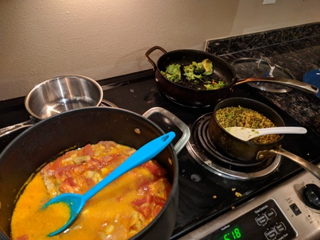
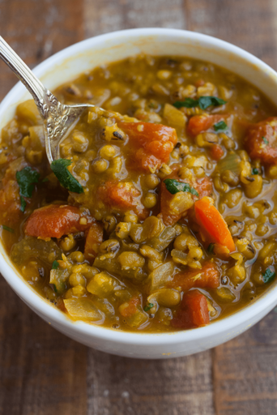
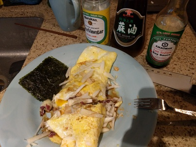
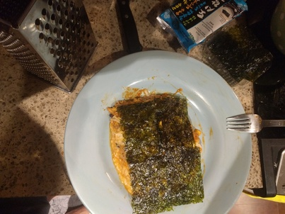

<!-- page_number: true -->
<!-- $theme: gaia -->
# Cookbook for Strength Athletes

---

## Fish and Shrimp (bangladeshian dish)

TODO: add details

---

## Mung Bean Soup

**Ingredients:**

* onion
* garlic - a few cloves
* 3 cups of mung beans
* 9 cups of water
* Trumeric - 1 tbs, salt
* Any veggies you want - mushrooms, broccoli, spourt beans, tomatoes

**How to make it:**

Saute onions and garlic in a big pot, add mung beans, water, trumeric, and salt and wait until it boils.
Lower the heat and keep for 45 minutes. Add the veggies whenever you want during that time.

---

## Daikon Omlet

TODO: add details

---

## Yamaimo Pancake

---

TODO: add details

---

## Okonomiyaki

TODO: try making it

https://www.seriouseats.com/2011/04/seriously-asian-naga-imo.html

---

## Kacchi Biryani

Traditional Bangladeshi dish

TODO: try making it

https://www.youtube.com/watch?v=jeUrcVr5oMA

---

## Mountain Yam

* Yam, Goji bearries, snowpeas, woodear (fungus, crunchy, healthy, 0 cal mushrooms)

---

# Poke with Taro chips

**Ingredients:**

Sashimi-grade tuna ,taro, sesame seeds, rice vinegar, onions/scallions

**How to make it:**
Cut the taro with a food processor or Kitchen Slicer and bake in the over for 10-15 min on 350 degrees.
Cut the tuna, add all ingredients and serve it on top of the taro.

---

# Kaarage

**Ingredients:**

Chicken thighs, potato starch, sake, soy sauce, ginger

**How to make it:**

Marinade the chicken 1-2 days in sake, soy sauce and ginger. Cook with a skillet or bake with potato starch.

---

## Kazahk Beshbarmak

TODO: try making it (:

https://www.youtube.com/watch?v=i_o7DgGW6ac

---

## Energy cookies

Those cookies are perfect source for carbs after a  lifting session. Eat them with your protein shake or with raw milk for extra explosive taste.

* ?
* ?
* ?

---

# Unknown Dish (Japanese)

* Any White fish, Yamaimo, Tamari, brown sugar

---

# energy bar

* Maple syrup, nuts, toasted almonds, shredded coconut, walnuts or cashews, fig

---

## Kale Salad

TODO:

---
