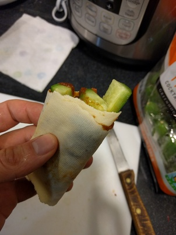

<!-- page_number: true -->
<!-- $theme: gaia -->
# Cookbook for Strength Athletes

---

## Cottage Cheese Pancakes

In food processor:
* 1 cup cottage cheese
* 1/3 cup all-purpose flour
* 2 tablespoons vegetable oil
* banana flavor
* 3 eggs, lightly beaten

Serve with low calorie syrop like Log Cabin

---

## Quest protein bar

* 2 tbsp fiber syrup
* 2 tsp almond our oats flour
* 1 scoop protein
* chia seeds, hemp seeds, flax seeds, berries

add syrup to skillet. hit up until you see bubbles. add flour and protein powder and mix. move to zip lock bag and add some fun seeds and maybe berries. mix well until it's solid and shape into whatever you want.

---

## Sushi for bodybuilders

---

* paper tofu
* cucumber
* chicken slidces or shrimp
* red chili sauce

bake the squash and thread with a fork.
hand roll seaweed with everytihng.

---

## Sushi when you need to cut fat

* Squash
* seaweed with wasabi
* chicken slidces or shrimp
* code raw

bake the squash and thread with a fork.
hand roll seaweed with everything.

---

## Energy cookies

Those cookies are perfect source for carbs after a  lifting session. Eat them with your protein shake or with raw milk for extra explosive taste.

* ?
* ?
* ?

---

## Daikon salad

---

* Daikon (white radish)
* Sesame seeds
* Soy sauce
* Rice Vineger
* Sugar
* Sesame oil
* Bonito flake(fish flakes)
* Shredded nori seaweed

How to make it:
1. Put everything in a bowl.
1. Cut daikon - pile the skin and cut into thin sticks.
1. Add daikon to bowl of dressing and mix.
1. Serve with bonito flakes and nori.

---

## Yamaimo with Honey

* Yamaimo (Japanese root vegetable)
* Honey

How to make:
1. Cut the Yamaimo to whatever chunks you want and steam it for 30 minutes.
1. Serve with honey.

---

## Quinoa with Cranberries

---

Amazing dish with a ton of protein. We have three layers:

**Ingredients:**
1. Bottom - Quinoa, Dried Cranberries
1. Middle - Sesame oil, Onions, Chicken, Broccoli, Eggs, Soy Sauce, Rice Vinegar, Yamaimo (Japanese mountain yam)
1. Top - Tomatoes, Seaweed

**How to make it:**
1. Bottom

Cook the quinoa with the cranberries. You can add them from the start or later on. Use whatever method you prefer to cook it - pot or instant pot.

2. Middle

On a skillet, sauté with sesame oil and add chopped onions until they are golden. Add small chicken slices until it's cooked. Add broccoli, a few eggs, 1 tbs of soy sauce and rice vinegar. Turn the hit off and grad the Yamaimo on top of everything.

3. Top

Serve everything: quinoa at the bottom, the content of the skillet above it, and add tomatoes and seaweed on the top.

Note: You can also use the following as replacements or additions: rice, shrimp, mushrooms, bell pepper, squash, and feta cheese.

---

## Fish and Shrimp (bangladeshian dish)

---

TODO: add details

---

## Bangladeshian Yogurt

* Greek Yogurt, milk, salt, date, goji berries

Add everything to a blender.

TODO: add picture

---

## Daikon omlet

---

TODO: add details

---

## Yamaimo pancake

---

TODO: add details

---

## Okonomiyaki

TODO: try making it (:

https://www.seriouseats.com/2011/04/seriously-asian-naga-imo.html

# Kazahk Beshbarmak

TODO: try making it (:

https://www.youtube.com/watch?v=i_o7DgGW6ac
