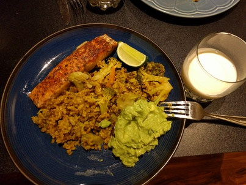
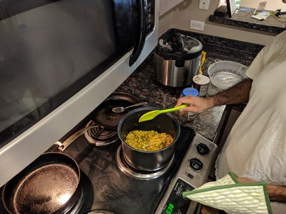

<!-- page_number: true -->
<!-- $theme: gaia -->
# Cookbook for Strength Athletes

## Quinoa with Cranberries

Amazing dish with a ton of protein. We have three layers:

**Ingredients:**

1. Bottom - Quinoa, Dried Cranberries
1. Middle - Sesame oil, Onions, Chicken, Broccoli, Eggs, Soy Sauce, Rice Vinegar, Yamaimo (Japanese mountain yam)
1. Top - Tomatoes, Seaweed

**How to make it:**

1. Bottom

Cook the quinoa with the cranberries. You can add them from the start or later on. Use whatever method you prefer to cook it - pot or instant pot.

2. Middle

On a skillet, Saute with sesame oil and add chopped onions until they are golden. Add small chicken slices until it's cooked. Add broccoli, a few eggs, 1 tbs of soy sauce and rice vinegar. Turn the hit off and grad the yamaimo on top of everything.

3. Top

Serve everything: quinoa at the bottom, the content of the skillet above it, and add tomatoes and seaweed on the top.

Note: You can also use the following as replacements or additions: rice, shrimp, mushrooms, bell pepper, squash, and feta cheese.

---

## Bengali Khichuri with Salmon

**Ingredients:**

* Khichuri: Brown rice, mung beans, onions, chillies, broccoli, trumeric, lemon
* Protein: Salmon
* Fat: Avocado, chillies, salt

**How to make it:**

* Saute rice, beans, onions, chillies, and trumeric with some oil in a pot for 5 min. Cook with instant pot/slow cooker, or on the stove. Add brocoli toward the end.
* Cook the salmon with whatever spices you like.
* Smash the avocado, chillies (cut them super thin), and salt

Serve together and squeeze the lemon on everything.

---

## Fish and Shrimp (bangladeshian dish)

TODO: add details

---

## Mung Bean Soup

**Ingredients:**

* onion
* garlic - a few cloves
* 3 cups of mung beans
* 9 cups of water
* Trumeric - 1 tbs, salt
* Any veggies you want - mushrooms, broccoli, spourt beans, tomatoes

**How to make it:**

Saute onions and garlic in a big pot, add mung beans, water, trumeric, and salt and wait until it boils.
Lower the heat and keep for 45 minutes. Add the veggies whenever you want during that time.

---

## Daikon Omlet

TODO: add details

---

## Yamaimo Pancake

---

TODO: add details

---

## Okonomiyaki

TODO: try making it

https://www.seriouseats.com/2011/04/seriously-asian-naga-imo.html

---

## Kacchi Biryani

Traditional Bangladeshi dish

TODO: try making it

https://www.youtube.com/watch?v=jeUrcVr5oMA

---

## Mountain Yam

* Yam, Goji bearries, snowpeas, woodear (fungus, crunchy, healthy, 0 cal mushrooms)

---

# Poke with Taro chips

**Ingredients:**

Sashimi-grade tuna ,taro, sesame seeds, rice vinegar, onions/scallions

**How to make it:**
Cut the taro with a food processor or Kitchen Slicer and bake in the over for 10-15 min on 350 degrees.
Cut the tuna, add all ingredients and serve it on top of the taro.

---

# Kaarage

**Ingredients:**

Chicken thighs, potato starch, sake, soy sauce, ginger

**How to make it:**

Marinade the chicken 1-2 days in sake, soy sauce and ginger. Cook with a skillet or bake with potato starch.

---

## Kazahk Beshbarmak

TODO: try making it (:

https://www.youtube.com/watch?v=i_o7DgGW6ac

---

## Energy cookies

Those cookies are perfect source for carbs after a  lifting session. Eat them with your protein shake or with raw milk for extra explosive taste.

* ?
* ?
* ?

---

# Unknown Dish (Japanese)

* Any White fish, Yamaimo, Tamari, brown sugar

---

# energy bar

* Maple syrup, nuts, toasted almonds, shredded coconut, walnuts or cashews, fig

---

## Kale Salad

TODO:

---
